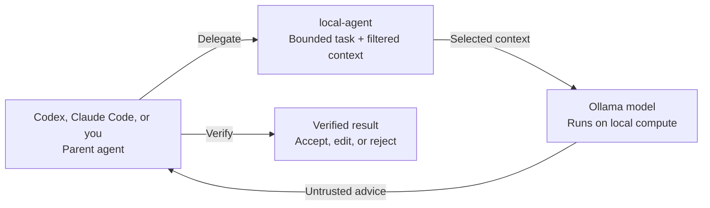

# Local Agent Toolkit

**Keep frontier-model tokens for frontier-model work.**

[](https://github.com/tomerzipori/local-agent-toolkit/actions/workflows/ci.yml)


[](LICENSE)

`local-agent` lets Codex, Claude Code, or a human developer delegate **small, bounded coding tasks** to an Ollama model running on local hardware.

Use local compute for repository exploration, first-pass reviews, test ideas, diagnostics, and candidate patches—while reserving expensive cloud tokens and frontier-model attention for harder decisions.

The local model is a worker, not the authority. Its output is untrusted advice that must be independently verified.

> [!NOTE]
> Token savings depend on the task, model, context size, and verification overhead. The toolkit enables controlled delegation; it does not guarantee a fixed reduction in cloud usage.

> [!TIP]
> **Contributions are wanted.** New commands, model-selection improvements, integrations, platform support, tests, examples, and documentation fixes are all welcome.

## How it works



With the default Ollama host, source context stays on your machine. The toolkit filters repository context, blocks sensitive paths by default, and can recommend a suitable installed model for the task and requested context size.

## Capabilities

| Need | Commands |
| --- | --- |
| Choose a model | `recommend-model`, `models` |
| Explore code | `find`, `files` |
| Plan a change | `plan`, `impact` |
| Review work | `review`, `review-staged`, `review-branch` |
| Design or draft tests | `test-plan`, `write-tests` |
| Diagnose failures | `diagnose`, `fix-test` |
| Challenge an approach | `second-opinion` |
| Draft a small patch | `patch` |

Most commands are read-only. `patch` and `write-tests` print candidate diffs without applying them. `fix-test` executes the exact reviewed shell command supplied through `--command` before analyzing its output.

## Requirements

- macOS with zsh is the primary supported environment.
- Python 3.10–3.13; the CLI uses only the standard library.
- Ollama with at least one installed model.
- Git for repository-aware commands.
- Codex and Claude Code are optional; the CLI works directly from a terminal.

Ubuntu is exercised in CI. Windows and non-zsh installation are not currently supported public interfaces.

## Quick start

### 1. Install the toolkit

```bash
git clone https://github.com/tomerzipori/local-agent-toolkit.git
cd local-agent-toolkit
chmod +x install.sh
./install.sh --skills both
source ~/.zshrc
```

Choose `codex`, `claude`, `both`, or `none`:

```bash
./install.sh --skills codex
./install.sh --skills claude
./install.sh --skills both
./install.sh --skills none
```

### 2. Inspect and configure models

```bash
ollama list
local-agent models
local-agent configure
```

For noninteractive setup:

```bash
local-agent configure \
  --model 'your-installed-model-name' \
  --host http://127.0.0.1:11434 \
  --num-ctx 32768 \
  --max-chars 120000
```

### 3. Delegate a bounded task

```bash
local-agent files \
  "Explain the responsibilities, assumptions, and risks" \
  src/client.py src/retry.py
```

Inspect the exact context before contacting Ollama:

```bash
local-agent files \
  "Explain the retry flow" \
  src/client.py src/retry.py \
  --show-context-files
```

### 4. Let the toolkit choose a model

```bash
MODEL="$(local-agent recommend-model review --num-ctx 16384 --name-only)"

local-agent review \
  "Look for correctness regressions and missing tests" \
  --model "$MODEL" \
  --num-ctx 16384
```

The deterministic recommender filters models that lack the requested context or estimated memory capacity, then ranks the remaining candidates for the command. It reads metadata and system memory but never loads, unloads, benchmarks, or runs inference with a model.

## More examples

```bash
local-agent find "Where is retry behavior implemented?"
local-agent review-staged "Pre-commit correctness review"
local-agent review-branch "Review before opening a PR" --base origin/main
local-agent plan "Add validation for empty package names" src/config.py tests/test_config.py
git diff | local-agent second-opinion --stdin "Challenge the design choices"
pytest tests/test_sampling.py -x 2>&1 | local-agent diagnose --stdin "Find the likely cause"
```

`fix-test` deliberately executes its supplied command. Only pass commands you have personally reviewed and would run directly yourself.

## Codex and Claude Code

The installer can copy the personal skill to:

- Codex: `~/.agents/skills/local-agent-toolkit`
- Claude Code: `~/.claude/skills/local-agent-toolkit`

Restart existing sessions after installation, then use a prompt such as:

```text
Use local-agent to review the staged diff before you do your own review.
```

The skill recommends a model, delegates one narrow task, and instructs the parent agent to verify the result. Installation does not guarantee that every session will invoke the skill automatically.

## Safety boundaries

By default, the toolkit:

- includes Git-tracked files only;
- excludes ignored, untracked, sensitive, binary, symlinked, external, and oversized files;
- limits file count, file size, and total context;
- reports how much context is being sent.

Opt-in flags include `--include-untracked`, `--include-ignored`, `--allow-sensitive-files`, `--allow-outside-repo`, `--allow-remote-host`, and `--allow-insecure-remote-host`.

Use `--show-context-files` whenever scope or sensitivity is uncertain.

> [!IMPORTANT]
> The default host is `http://127.0.0.1:11434`. A non-local host receives the supplied source context and requires explicit approval flags.

Keep final decisions about credentials, permissions, destructive operations, deployments, migrations, security, broad data-integrity risks, and public APIs with the parent agent.

## Model recommendation

Useful diagnostics:

```bash
local-agent recommend-model review --num-ctx 16384 --json
local-agent models --verbose
local-agent recommend-model review --refresh
```

The recommender is conservative, explainable, and deterministic—not a quality leaderboard. Memory use for unloaded models is estimated, a safe model may still run slowly, and parameter count or quantization alone does not determine quality. Preferences cannot bypass context or memory safety filters.

## Configuration

Configuration is saved at `~/.config/local-agent/config.json`. Values resolve from command-line options, environment variables, saved configuration, then built-in defaults.

| Setting | Default |
| --- | ---: |
| Ollama host | `http://127.0.0.1:11434` |
| Model context window | `32768` tokens |
| Supplied context budget | `120000` characters |
| Maximum file size | `256000` bytes |
| Maximum context files | `200` |

See [the installer and configuration reference](docs/installer-reference.md) for managed paths, environment variables, reinstall behavior, model-cache details, remote hosts, and uninstallation.

## Contributing

This project is intended to grow into a shared toolbox for practical local-model delegation. Small, focused pull requests are welcome.

Useful contribution areas include:

- new bounded commands and integrations;
- model recommendation and memory estimation;
- prompts, output contracts, and safety controls;
- Linux, Bash, Fish, or Windows support;
- reproducible model notes and benchmarks;
- tests, documentation, and usability improvements.

Start with [CONTRIBUTING.md](CONTRIBUTING.md), or [open an issue](https://github.com/tomerzipori/local-agent-toolkit/issues) for an idea or rough edge.

## Development

```bash
bash scripts/check.sh
python3 -m unittest discover -s tests -v
```

CI tests Python 3.10, 3.11, and 3.13 and runs Ruff, ShellCheck, CodeQL, and secret scanning.

## Limitations

- Quality and speed depend on the model, quantization, context, task, and hardware.
- Repository context may be incomplete or truncated.
- The recommender estimates fit; it does not benchmark quality or performance.
- macOS and zsh are the primary supported installation environment.
- Saving cloud tokens still requires careful task selection and efficient verification.

## Uninstall

```bash
./install.sh --uninstall
./install.sh --uninstall --purge-config
```

The uninstaller removes only toolkit-managed paths and marked integration blocks.

## License

[MIT](LICENSE) © 2026 Tomer Zipori
