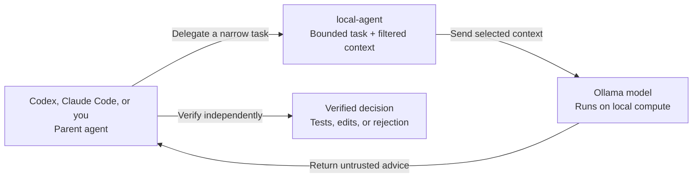

# Local Agent Toolkit

**Keep frontier-model tokens for frontier-model work.**

[](https://github.com/tomerzipori/local-agent-toolkit/actions/workflows/ci.yml)


[](LICENSE)

`local-agent` lets Codex, Claude Code, or a human developer delegate **small, bounded coding tasks** to an Ollama model running on local hardware.

The goal is simple: use local compute for repeatable work such as repository exploration, file summaries, first-pass reviews, test ideas, diagnostics, and candidate patches—while reserving expensive cloud tokens and frontier-model attention for decisions that genuinely need them.

The local model is a worker, not the authority. Its output is untrusted advice that the parent agent must verify before using.

> [!NOTE]
> Token savings depend on the task, model, context size, and verification overhead. The toolkit makes delegation practical and controlled; it does not guarantee a fixed reduction in cloud usage.

> [!TIP]
> **Contributions are wanted.** New commands, safer workflows, model-selection improvements, agent integrations, platform support, examples, and documentation fixes are all welcome—including small first pull requests.

## The idea

A frontier coding agent is excellent at orchestration and difficult reasoning, but it often spends context on work a smaller local model can handle:

- finding likely files and symbols;
- explaining a focused set of files;
- drafting an implementation or test plan;
- reviewing a diff before the parent agent reviews it again;
- diagnosing supplied errors and test output;
- proposing a small patch or a second opinion.



With the default Ollama host, source context stays on your machine. The toolkit filters repository context, blocks sensitive paths by default, makes remote-host use explicit, and can recommend a safe installed model for the requested task and context size.

## What it can do

| Need | Commands | Result |
| --- | --- | --- |
| Choose a local model | `recommend-model`, `models` | An explainable recommendation based on task profile, context capacity, and estimated memory fit |
| Explore a repository | `find`, `files` | Likely files, symbols, execution paths, and focused explanations |
| Plan a change | `plan`, `impact` | Ordered implementation steps, affected areas, risks, and tests |
| Review work | `review`, `review-staged`, `review-branch` | Actionable findings against current diffs |
| Design or draft tests | `test-plan`, `write-tests` | Test cases or a candidate unified diff |
| Diagnose failures | `diagnose`, `fix-test` | Root-cause hypotheses and a minimal correction proposal |
| Challenge an approach | `second-opinion` | Hidden assumptions, counterexamples, and simpler alternatives |
| Draft a small change | `patch` | A candidate unified diff for the parent agent to inspect |

Most commands are read-only. `patch` and `write-tests` print proposed diffs but do not apply them. `fix-test` is the exception: it executes the exact shell command supplied through `--command` before asking the model to analyze the result.

## Requirements

- **macOS with zsh** is the primary supported environment.
- **Python 3.10–3.13**. The CLI uses only the Python standard library.
- **Ollama**, running locally or at an explicitly approved host.
- At least one model already installed in Ollama.
- **Git** for repository-aware commands such as reviews, impact analysis, and discovery.
- Codex or Claude Code is optional; the CLI also works directly from a terminal.

Ubuntu is included in CI, but non-zsh installation behavior is not yet a fully supported public interface. The installer does not currently support Windows.

## Quick start

### 1. Install Ollama and a local model

Confirm that Ollama is running and that at least one model is available:

```bash
ollama list
```

### 2. Install the toolkit

```bash
git clone https://github.com/tomerzipori/local-agent-toolkit.git
cd local-agent-toolkit
chmod +x install.sh
./install.sh --skills both
source ~/.zshrc
```

Choose the integration you actually use:

```bash
./install.sh --skills codex
./install.sh --skills claude
./install.sh --skills both
./install.sh --skills none
```

`--skills none` installs the CLI without adding a personal Codex or Claude Code skill.

### 3. Inspect and configure models

```bash
local-agent models
local-agent models --verbose
local-agent configure
local-agent configure --show
```

For noninteractive setup:

```bash
local-agent configure \
  --model 'your-installed-model-name' \
  --host http://127.0.0.1:11434 \
  --num-ctx 32768 \
  --max-chars 120000
```

### 4. Let the toolkit choose a model

The recommender maps commands to fast, balanced, or strong quality profiles, filters models that do not fit the requested context or estimated memory budget, and returns a deterministic recommendation.

```bash
local-agent recommend-model files --num-ctx 8192
local-agent recommend-model review --num-ctx 16384 --name-only
```

Use the returned model explicitly with the same context size:

```bash
MODEL="$(local-agent recommend-model review --num-ctx 16384 --name-only)"

local-agent review \
  "Look for correctness regressions and missing tests" \
  --model "$MODEL" \
  --num-ctx 16384
```

The recommender is read-only. It inspects installed and running model metadata, cached static metadata, and system memory; it does not load, unload, benchmark, or run inference with a model.

### 5. Try a bounded task

```bash
local-agent files \
  "Explain the responsibilities, assumptions, and risks" \
  src/client.py src/retry.py
```

Before sending anything to Ollama, inspect the exact context manifest:

```bash
local-agent files \
  "Explain the retry flow" \
  src/client.py src/retry.py \
  --show-context-files
```

## Example workflows

### Find where something is implemented

```bash
local-agent find "Where is retry behavior implemented?"
```

### Review current changes

```bash
local-agent review "Look for correctness regressions and missing tests"
local-agent review-staged "Pre-commit correctness review"
local-agent review-branch "Review before opening a PR" --base origin/main
```

### Plan a focused change

```bash
local-agent plan \
  "Add validation for empty package names" \
  src/config.py tests/test_config.py
```

### Ask for a second opinion

```bash
git diff | local-agent second-opinion --stdin \
  "Challenge the design choices in this diff"
```

### Diagnose failure output without executing it

```bash
pytest tests/test_sampling.py -x 2>&1 | \
  local-agent diagnose --stdin \
  "Explain the most likely root cause"
```

### Execute a reviewed test command and analyze the result

```bash
local-agent fix-test \
  "Diagnose the failure and propose a minimal fix" \
  --command 'pytest tests/test_sampling.py -x' \
  src/sampling.py tests/test_sampling.py
```

Only pass commands to `fix-test` that you have personally reviewed and would run directly yourself.

## Using it from Codex or Claude Code

The installer can copy the toolkit's personal skill to:

- Codex: `~/.agents/skills/local-agent-toolkit`
- Claude Code: `~/.claude/skills/local-agent-toolkit`

Restart or refresh existing sessions after installation so the agent can rediscover the skill. Then use a prompt such as:

```text
Use local-agent to review the staged diff before you do your own review.
```

The skill instructs the parent agent to recommend a model for the chosen command and planned context size, delegate one narrow task, and independently verify the result.

Installing the skill enables the workflow, but it does not prove that every agent session will discover or invoke it automatically.

## Context and safety boundaries

By default:

- explicit Git-tracked files are included;
- directories expand to Git-tracked files only;
- untracked and ignored files are excluded;
- common secret and credential paths are blocked;
- symlinks, binary files, oversized files, and files outside the repository are skipped;
- context is bounded by file-count, file-size, and character limits;
- the CLI reports how many files and characters are being sent.

Relevant opt-in flags include:

```text
--include-untracked
--include-ignored
--allow-sensitive-files
--allow-outside-repo
--allow-remote-host
--allow-insecure-remote-host
```

Use `--show-context-files` whenever the scope or sensitivity of a request is uncertain.

> [!IMPORTANT]
> The default host is `http://127.0.0.1:11434`. If you configure a non-local Ollama host, supplied source code is sent to that server. Remote hosts require explicit approval flags, and remote plain-HTTP hosts require an additional insecure-host flag.

## Model recommendation details

Useful diagnostic commands:

```bash
local-agent recommend-model review --num-ctx 16384 --json
local-agent models --verbose
local-agent recommend-model review --refresh
```

The recommender is conservative and explainable, not a universal quality leaderboard. It considers coding suitability, requested context, estimated memory fit, whether a model is already resident, parameter count, and quantization using command-specific ranking profiles.

Important caveats:

- installed artifact size is not exact runtime memory usage;
- memory for unloaded models is estimated;
- a model classified as safe may still run slowly;
- parameter count does not fully determine quality;
- mixture-of-experts total parameters can overstate active computation;
- quantization is used conservatively rather than as a universal quality score;
- preferences cannot bypass context or memory safety filters.

## Configuration

Saved configuration lives at `~/.config/local-agent/config.json`.

Settings resolve in this order:

1. command-line option;
2. environment variable;
3. saved configuration;
4. built-in default.

```bash
export LOCAL_AGENT_MODEL='your-installed-model-name'
export LOCAL_AGENT_HOST='http://127.0.0.1:11434'
export LOCAL_AGENT_NUM_CTX='32768'
export LOCAL_AGENT_MAX_CHARS='120000'
```

| Setting | Default |
| --- | ---: |
| Ollama host | `http://127.0.0.1:11434` |
| Model context window | `32768` tokens |
| Supplied context budget | `120000` characters |
| Maximum individual file size | `256000` bytes |
| Maximum context files | `200` |

See [the installer and configuration reference](docs/installer-reference.md) for managed paths, reinstall behavior, dry runs, skill ownership checks, model inventory details, remote-host rules, and uninstallation.

## What should stay with the parent agent

Do not use a local worker as the final decision-maker for credentials, permissions, destructive operations, deployments, migrations, security-sensitive changes, broad concurrency or data-integrity decisions, public API commitments, or any result that has not been independently inspected and tested.

A local model can still gather evidence or challenge an approach, but the parent agent remains responsible for the final call.

## Contributing is encouraged

This project is intended to grow into a shared toolbox for practical local-model delegation. Contributions are not merely tolerated—they are part of the plan.

Especially useful contributions include:

- new commands for bounded, verifiable coding tasks;
- model recommendation and memory-estimation improvements;
- improved prompts and output contracts;
- safer context collection and secret handling;
- Codex, Claude Code, or other coding-agent integrations;
- Linux, Bash, Fish, or Windows support;
- model compatibility notes and reproducible benchmarks;
- tests, documentation, and usability improvements.

Small, focused pull requests are welcome. Start with [CONTRIBUTING.md](CONTRIBUTING.md), run the local checks, and explain the user-facing behavior your change adds or improves.

Found a rough edge or have an idea that is not ready for code? [Open an issue](https://github.com/tomerzipori/local-agent-toolkit/issues).

## Repository layout

```text
bin/local-agent                       # Dependency-free Python CLI
install.sh                            # Managed installer and uninstaller
skills/local-agent-toolkit/           # Codex and Claude Code personal skill
skills/local-agent-toolkit/references/ # Delegation and verification policy
scripts/                              # Development, benchmark, installer, and release checks
tests/                                # Unit and installer behavior tests
docs/                                 # Detailed user and contributor references
```

`bin/local-agent` is currently the executable's single source of truth.

## Development

```bash
bash scripts/check.sh
python3 -m unittest discover -s tests -v
```

CI covers Python 3.10, 3.11, and 3.13 on Ubuntu, plus release-critical Python and installer checks on macOS. It also runs Ruff, ShellCheck, CodeQL, and secret scanning.

## Limitations

- Local-model quality varies by model, quantization, context length, and task.
- Context may be incomplete or truncated, especially for large repositories.
- Local inference speed and capacity depend on your hardware.
- The recommender estimates fit; it does not benchmark quality or performance.
- macOS and zsh are the primary supported installation environment today.
- Smaller models may produce invalid patches, miss cross-file behavior, or confidently state incorrect conclusions.
- Saving cloud tokens still requires a parent workflow that delegates suitable work and verifies the result efficiently.

## Uninstall

```bash
./install.sh --uninstall
./install.sh --uninstall --purge-config
```

The uninstaller removes only toolkit-managed paths and marked integration blocks. See [the installer reference](docs/installer-reference.md) for the exact behavior.

## License

[MIT](LICENSE) © 2026 Tomer Zipori
